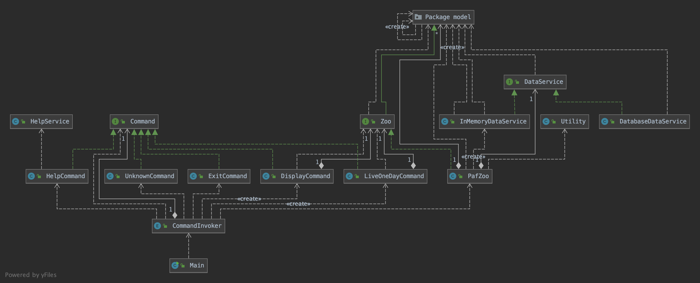

# PafZoo
This is a simple Java console project(Maven) for developer test assignment of PAF.
 
#### Usage
**build**
 ```shell script
mvn clean package
```
After build, a jar file --`PafZoo-1.0-SNAPSHOT.jar` will be generated under target folder.

**start**

```shell script
java -cp target/PafZoo-1.0-SNAPSHOT.jar com.paf.zoo.Main
```

After the program starts, a usage instruction will be shown by default. The program
supports 4 types of command: `display`, `live`, `help` and `exit`.

```shell script
-------------- Help/Usage ---------------
Commands in the zoo system:
display		Show current status of all animals in zoo
live		Live one day in zoo, all changes in zoo will be displayed
help		Show help information of command usage
exit		Exit system
```

#### Design

The following picture is the classes diagram of my application. The application design is aiming for
expandability and maintainability. If `Spring` framework is allow to use, a better version could
be designed. 


There are 4 main layers `main`, `command`, `service` and `model`. Each layer only has interactions with
its neighbor layers. 
* The `main` layer is only consist of the `Main` class. It accepts user input from the console.
By default, the application executes `HELP` command to show usage/help information to users.
`Main` class doesn't need to know what commands are supported and how they are implemented.
* The `command` layer defines all the commands supported by the application. Each `command` might call
specific service to execute the command.
* All the business logic is implemented in `service` layer. Such as how a zoo is initialized,
what happens living one day in the zoo? There is a class `DatabaseDataService` defined in `service`
layer. Implement it if you want save your data into a database instead of having it in memory.
* `Model` layer contains all the definitions of DTO(data transfer object). As the property optionality
is not clear to me. In my program, `name` and `favoriteFood` are obligatory, other properties are optional.
I only implemented the `builder` pattern on models: `Chicken`, `Parrot` and their parent class `Bird`. 


**Important aspects**
1. Friendship actions(build/break) of different animals should occur in parallel;
2. Command design pattern makes the program extendable;
3. If A and B are already friends, they couldn't establish friendship again;
4. Animal couldn't build friendship with itself;

#### Questions
* If package Mockito is allowed to use, some unit tests of `Command` implementation could be added
* Could two animals have the same name? I assume `Yes`, two animals with with exactly the same 
properties shouldn't be equal. In the program, there a `UUID` property to identify `Animal`.
* Which properties of animal are required, which properties are optional? In my program,
`name` and `favoriteFood` are obligatory， other properties are optional.  